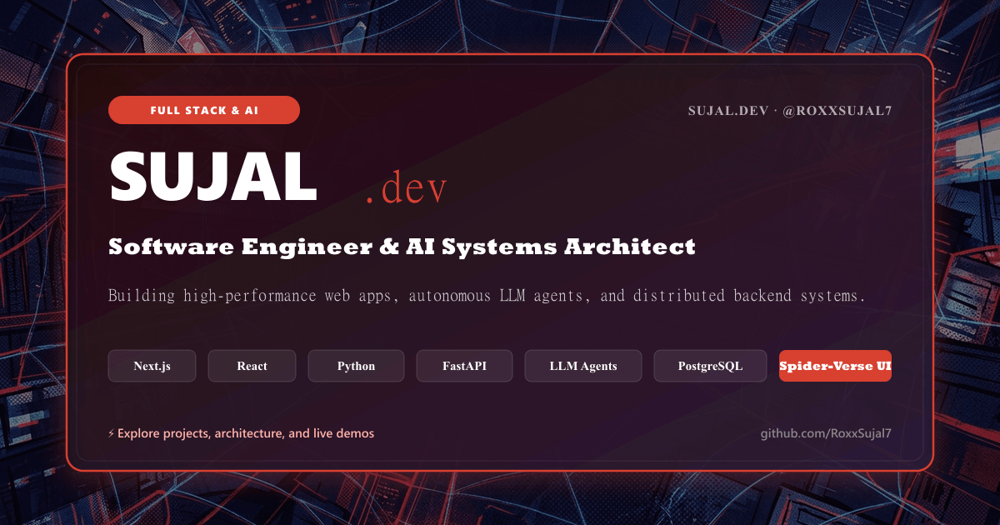
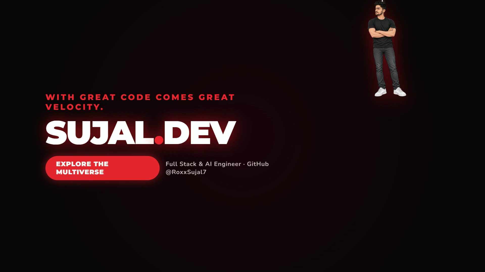
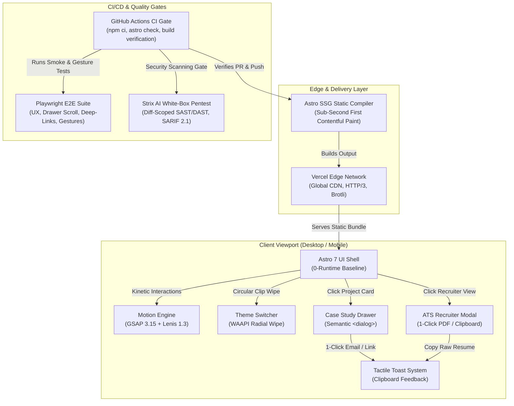

# Sujal · Full Stack & AI Engineer Portfolio

<div align="center">

[](https://astro.build/)
[](https://www.typescriptlang.org/)
[](https://gsap.com/)
[](https://lenis.darkroom.engineering/)
[](https://playwright.dev/)
[](https://github.com/RoxxSujal7/portfolio_roxx/actions)
[](LICENSE)

<br/>



<br/>

**Interactive, poster-style portfolio for Sujal — Full Stack & AI Software Engineer.**  
Featuring *Into the Spider-Verse* comic art direction, in-page case study slide-over drawers, one-click ATS recruiter resume overlay, tactile physical interactions, advanced GSAP choreographies, Lenis kinetic smooth scrolling, and an interactive **Spidey** dark mode with radial wipe transitions.

🌐 **Live Sites**: [sujal.dev](https://sujal.dev) &nbsp;|&nbsp; [portfolio-roxx.vercel.app](https://portfolio-roxx.vercel.app/)  
🐙 **GitHub**: [@RoxxSujal7](https://github.com/RoxxSujal7) &nbsp;|&nbsp; 💼 **LinkedIn**: [sujalroxx7](https://www.linkedin.com/in/sujalroxx7/) &nbsp;|&nbsp; 📬 **Email**: [sujalsah9@gmail.com](mailto:sujalsah9@gmail.com)

</div>

---

## 🎬 Launch Teaser: "Every Dimension Needs an Architect"

<div align="center">

<a href="./brag-output/brag-4k.mp4">
  
</a>

<br/>

**[▶️ Watch the 4K Cinematic Launch Trailer](./brag-output/brag-4k.mp4)** &nbsp;|&nbsp; **[1080p Version](./brag-output/brag.mp4)**

*A 20-second cinematic Spider-Verse blockbuster teaser showcasing 60fps kinetic motion, autonomous AI systems, and interactive Spidey dark mode physics.*

</div>

---

## 🏗️ System Architecture & Workflow (`/archify`)

> 🔍 **Interactive Architecture Viewer**: An explorable standalone HTML diagram with inline SVG, view chapters, pan/zoom, and theme switching is delivered at [public/architecture.html](public/architecture.html) (generated via `archify`).



---

## ⚡ Highlights & Engineering Features

### 1. 🗂️ In-Page Case Study Slide-Over Drawer
- **Progressive Disclosure**: Replaced disruptive external navigation links with an accessible, in-page slide-over panel (620px desktop dock, bottom-sheet mobile dock) built on the native semantic `<dialog>` element.
- **Architectural Depth**: Each project presents 3 quantitative production metrics (e.g. `< 1.2s` latency, `99.2%` accuracy, `10K+` WebSockets), a full 6-node architectural data pipeline, concrete technical tradeoffs, and runtime technologies.
- **Deep-Link URL Routing**: Supports direct URL hash navigation (e.g. `sujal.dev#project-systems` or `sujal.dev#project-agent`) to immediately open the corresponding case study for direct sharing.
- **Universal Input Forwarding & Scroll Restoration**: Custom wheel and touch event forwarding ensures scrolling on any part of the drawer smoothly navigates content. Includes non-destructive scroll-locking without layout shift, custom Spider-Verse scrollbars, and full keyboard navigation (`Escape`, `ArrowDown`, `PageDown`, `Home`, `End`).

### 2. 📄 One-Click ATS High-Density Recruiter View
- **Recruiter Conversion Engine**: A dedicated header action (`#recruiter-toggle`) engineered specifically for hiring managers and technical recruiters who need instant qualification data.
- **High-Density Overview**: Features a concise executive summary, structured ATS competencies matrix (AI Systems, Distributed Backend, Modern Frontend, Cloud & DevOps), 4 quantified production systems, and academic credentials.
- **Instant PDF Export (`window.print`)**: Includes tailored `@media print` stylesheets that strip web backdrops, navigation, and buttons, generating a clean 8.5x11 / A4 PDF resume on demand.
- **Plain-Text Export**: One-click clipboard export formatting the entire profile into structured markdown/text for immediate pasting into ATS or applicant tracking notes.

### 3. 📋 1-Click "Copy Email" & Tactile Toast System
- **Frictionless Contact**: Intercepts `mailto:` clicks to write `sujalsah9@gmail.com` directly to the visitor's clipboard.
- **Tactile Notification**: Displays an accessible bottom-center confirmation toast (`"Copied sujalsah9@gmail.com to clipboard! 📋"`) with a secondary fallback to launch external mail clients.

### 4. 🕷️ Illustrated Poster Art Direction & Spidey Theme
- **Comic Book Poster Aesthetic**: Warm vintage paper texture (`#faf8f3`), deep ink navy typography (`#1f1d3a`), sticker-style illustrations, taped note labels with natural rotational jitter, and custom SVG webs.
- **Interactive Spidey Dark Mode**:
  - Deep crimson accents (`#d8402f`), comic halftone patterns, red thread highlights, and comic sticker drop-shadow glows.
  - Smooth **circular radial wipe transition** powered by the Web Animations API (WAAPI), expanding dynamically from the toggle button coordinates across the entire viewport.
  - Persistent theme preference stored in `localStorage`.

### 5. 🎬 Advanced Animation & Motion Engineering
- **Cinematic Entrance Timeline**: Spidey swings in on a silk web line, lets go mid-air, squishes and rebounds into the hero landing pose, as taped labels rain down and the red thread draws itself dynamically via SVG `strokeDashoffset`.
- **Lenis Smooth Anchor Gliding**: All internal navigation links (`About`, `Work`, `Contact`, and hero CTA buttons) glide with exponential ease-out interpolation (`1.15s duration`, `-70px offset`), perfectly clearing the sticky navbar.
- **3D Magnetic Cursor Tilt**: Project cards track cursor coordinates in real-time, tilting across Euler angles (`rotateX`, `rotateY`) and rebounding elastically on mouse leave.
- **Interactive Spider Silk Physics**: Hovering over the spiders pulls them downward with dynamic SVG silk stretching (`elastic.out`), springing back on release.
- **Scroll-Velocity Responsive Pendulum**: The upside-down hanging Spider-Man reads scroll velocity via `ScrollTrigger.create` and swings wider with scroll momentum before settling into gentle idle oscillations.
- **Organic Floating Labels**: Hero skill notes gently float and breathe with staggered sine curves, firmly anchored to avoid accidental touch displacement.

---

## ✂️ Ponytail Simplicity & Anti-Bloat Audit (`/ponytail`)

This project strictly adheres to the **Ponytail Engineering Philosophy**: maximum visual fidelity with minimal dependency bloat, zero speculative abstractions, and native platform features over third-party npm packages.

### 1. Dependency Footprint
```text
Total Production Dependencies: 3
├── astro (Static Site Generation & 0-runtime baseline)
├── gsap  (60fps timeline choreography & ScrollTrigger)
└── lenis (Kinetic smooth scroll & anchor interpolation)
```

### 2. Ponytail Anti-Bloat Decisions
| Feature | Bloated Alternative (Avoided) | Native / Minimal Ponytail Implementation |
| :--- | :--- | :--- |
| **Case Study Drawer** | React modal library, Radix UI, Floating UI | Native HTML5 `<dialog>` + CSS `translateX` + semantic event forwarding |
| **Theme Radial Wipe** | Canvas 2D rerender, heavy GSAP clip plugin | Native Web Animations API (`Element.animate`) circular clip-path wipe |
| **ATS Resume PDF** | `jspdf`, `html2pdf.js` (~350KB bundle) | Native browser print engine (`window.print()`) + `@media print` styling |
| **Email Copy Action** | `clipboard.js` dependency | Native `navigator.clipboard.writeText()` API |
| **Icons & Art** | FontAwesome / Lucide icon bundles | Inline zero-overhead semantic SVGs |

### 3. Ponytail Debt Ledger
```text
[ponytail-debt] grep -rnE '(#|//) ?ponytail:' src/
src/scripts/theme.ts:1 -> dropped GSAP dep — clip-path wipe uses native WAAPI (already available, zero extra import).
Ledger Status: 1 deliberate platform substitution. 0 unaddressed debt items. Clean ledger.
```

---

## 🧪 Automated Testing & Verification Suite

The repository includes end-to-end browser test suites powered by Playwright to ensure regression-free deployments:

```bash
# Run comprehensive Playwright UX verification suite
node tests/test-ux-features.cjs

# Run drawer scroll & touch gesture forwarding test
node tests/test-drawer-scroll-v2.cjs

# Run GSAP motion, ScrollTrigger, & Lenis anchor test
node tests/test-motion-scroll.cjs
```

### Verification Checklist:
- ✅ **In-Page Case Study Slide-Over**: Drawer opens with title, 3 metric tiles, 6 architecture flow nodes, and tech stack.
- ✅ **Scroll & Keyboard Navigation**: `Escape` key cleanly closes dialog; `ArrowDown`/`PageDown` smoothly scrolls drawer panel.
- ✅ **Deep-Linking**: Direct URL hash (`#project-systems`) immediately triggers drawer launch.
- ✅ **Recruiter Modal**: Opens high-density ATS resume view with print trigger and text clipboard export.
- ✅ **Spidey Dark Mode**: Radial wipe transition smoothly switches tokens across light and dark palettes.
- ✅ **1-Click Copy Email**: Intercepts `mailto:`, copies to clipboard, and renders tactile toast notification.

---

## 🛠️ Tech Stack

| Layer | Technologies |
| :--- | :--- |
| **Framework** | [Astro 7](https://astro.build/) (Static Site Generation, 0-runtime baseline) |
| **Language & Types** | TypeScript 5.9, Semantic HTML5 |
| **Motion & Physics** | [GSAP 3.15](https://gsap.com/) (Timeline, ScrollTrigger), [Lenis 1.3](https://lenis.darkroom.engineering/) (Smooth Scroll), Web Animations API (WAAPI) |
| **Styling** | Vanilla CSS, OKLCH/HSL Design Tokens, Spidey Theme Variables |
| **Testing** | [Playwright](https://playwright.dev/) (Headless Chromium E2E verification) |
| **Architecture Tooling** | [Archify 2.17](docs/portfolio-architecture.json) (Showcase SVG / HTML system diagrams) |
| **Image Processing** | [Sharp 0.35](https://sharp.pixelplumbing.com/) (WebP conversion, SVG compositing) |
| **CI/CD & Security** | GitHub Actions, [Strix AI Pentesting](https://docs.strix.ai), CodeQL SARIF |

---

## 📁 Project Structure

```text
├── .github/
│   └── workflows/
│       ├── ci.yml                 # Build verification, typecheck, & audit gate
│       └── security.yml           # Strix AI diff-scoped pentest & SARIF workflow
├── brag-output/                   # 4K / 1080p Cinematic launch trailer & assets
├── docs/
│   └── portfolio-architecture.json # Archify system architecture specification
├── public/
│   ├── architecture.html          # Delivered interactive Archify architecture diagram
│   ├── favicon.svg                # Spider-Man mask SVG favicon
│   ├── og-image.png               # 1200x630 Open Graph preview banner
│   └── brandkit.jpg               # Brand identity guidelines board
├── scripts/
│   ├── create-og.js               # Node.js Sharp generator for social banner
│   └── serve-local.cjs            # Local test server runner
├── src/
│   ├── assets/
│   │   ├── stickers/              # Character sticker illustrations (hero, swing, crouch, etc.)
│   │   └── work/                  # Curated project preview artwork
│   ├── components/
│   │   ├── CaseStudyDrawer.astro  # Semantic in-page slide-over drawer component
│   │   ├── RecruiterModal.astro   # One-click ATS recruiter high-density modal
│   │   ├── Note.astro             # Taped label note with rotational tilt
│   │   ├── Spider.astro           # Interactive SVG spider with elastic silk
│   │   ├── Thumb.astro            # Stand-in project preview artwork
│   │   └── Web.astro              # Mathematically plotted spiderweb SVG
│   ├── pages/
│   │   └── index.astro            # Main landing page, SEO metadata, and project definitions
│   ├── scripts/
│   │   ├── drawer.ts              # Case study drawer controller, scroll lock, & hash routing
│   │   ├── recruiter.ts           # ATS recruiter modal controller & print export
│   │   ├── toast.ts               # Accessible tactile toast feedback utility
│   │   ├── motion.ts              # GSAP timelines, Lenis scroll, 3D tilt, and interactions
│   │   └── theme.ts               # Spidey / Paper WAAPI radial theme switcher
│   └── styles/
│       └── global.css             # Design tokens, Spidey dark theme, focus states, responsive layout
├── tests/
│   ├── test-ux-features.cjs       # Playwright E2E test suite (Drawer, Recruiter, Toast, Theme)
│   ├── test-drawer-scroll-v2.cjs  # Drawer wheel forwarding & keyboard scrolling test
│   └── test-motion-scroll.cjs     # GSAP ScrollTrigger & Lenis anchor navigation test
├── astro.config.mjs               # Astro static configuration
├── package.json                   # Dependencies, scripts, and engine specifications
└── tsconfig.json                  # TypeScript configuration
```

---

## 🚀 Local Development

```bash
# 1. Install dependencies
npm install

# 2. Start development server (available at http://localhost:4321/)
npm run dev

# 3. Run typecheck & Astro diagnostics
npm run check

# 4. Build static production bundle (outputs to /dist)
npm run build

# 5. Run automated Playwright UX test suites
node tests/test-ux-features.cjs

# 6. Preview production build locally
npm run preview
```

---

## 👤 Author

**Sujal**  
Full Stack & AI Engineer  
- 🌐 Website: [sujal.dev](https://sujal.dev) &nbsp;|&nbsp; [portfolio-roxx.vercel.app](https://portfolio-roxx.vercel.app/)  
- 🐙 GitHub: [@RoxxSujal7](https://github.com/RoxxSujal7)  
- 💼 LinkedIn: [in/sujalroxx7](https://www.linkedin.com/in/sujalroxx7/)  
- 📸 Instagram: [@roxxsujal7](https://www.instagram.com/roxxsujal7/)  
- 📬 Email: [sujalsah9@gmail.com](mailto:sujalsah9@gmail.com)

---

## 📄 License

Maintained for personal portfolio use under the [MIT License](LICENSE).
